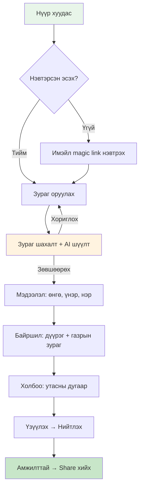
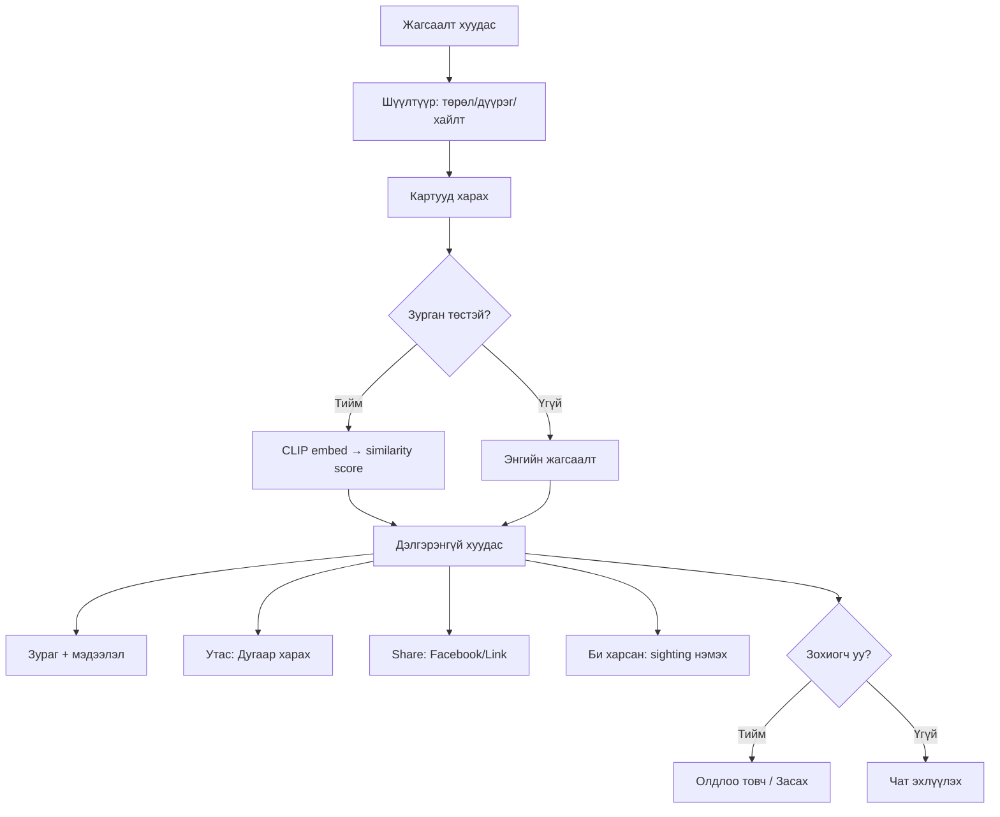
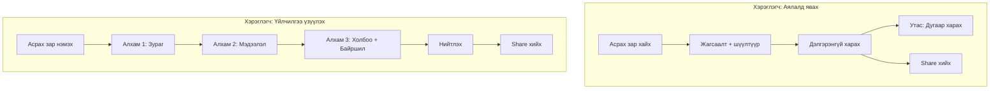
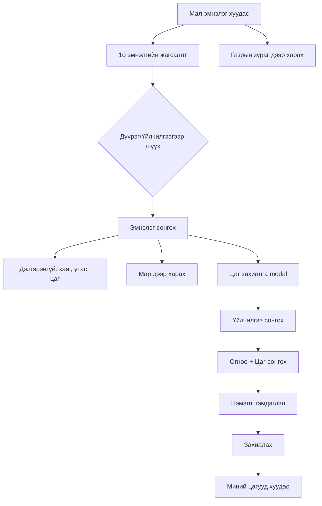
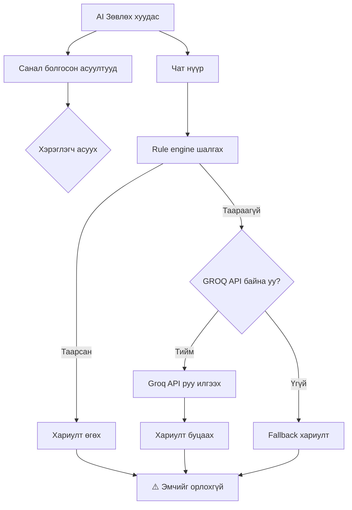
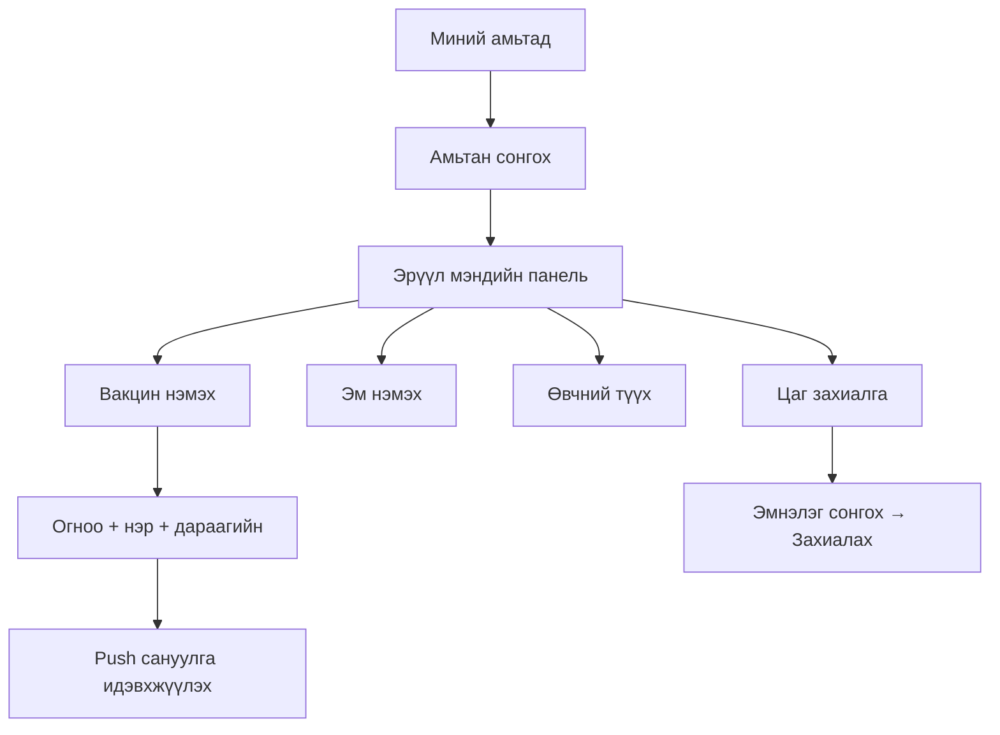
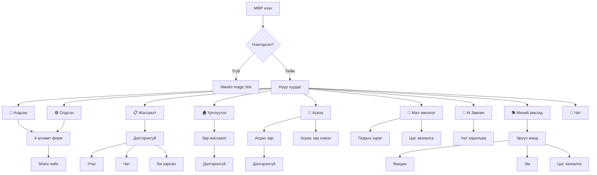

# МӨР — User Flow & Wireframe баримт

## 1. Нүүр хуудас → Алдсан мэдэгдэх (Report Lost)



### Wireframe — Алдсан мэдэгдэх форм (4 алхам)

```
┌─────────────────────────────────────────────┐
│  ← Буцах          🔴 Алдсан                │
│                                             │
│  ○ ● ○ ○   Зураг → Мэдээлэл → Байршил →   │
│  1/4: Зураг         Холбоо                  │
│                                             │
│  ┌─────────────────────────────────────┐    │
│  │                                     │    │
│  │     📷 Зураг оруулах               │    │
│  │        (drag & drop)               │    │
│  │                                     │    │
│  └─────────────────────────────────────┘    │
│                                             │
│  ┌─────────────────────────────────────┐    │
│  │ Preview: Алдсан Нохой — Lucky Boy   │    │
│  │ 📍 Баянзүрх                         │    │
│  │ ☎ 99**11                           │    │
│  └─────────────────────────────────────┘    │
│                                             │
│         [Дараах →]                          │
│                                             │
└─────────────────────────────────────────────┘
```

---

## 2. Жагсаалт → Дэлгэрэнгүй харах (Browse → Detail)



### Wireframe — Дэлгэрэнгүй хуудас

```
┌─────────────────────────────────────────────┐
│  ← Буцах                                    │
│  🔴 Алдсан амьтан                            │
│  Алдсан Нохой — Lucky Boy                   │
│  🕓 1 долоо хоногийн өмнө                    │
│                                             │
│  ┌──────────────────┐  ┌──────────────────┐ │
│  │                  │  │ Төрөл: Нохой     │ │
│  │                  │  │ Нэр: Lucky Boy   │ │
│  │   [ЗУРАГ]        │  │ Өнгө: хар халзан │ │
│  │                  │  │ Дүүрэг: Баянзүрх │ │
│  │                  │  │ Газар: 26-р хо   │ │
│  └──────────────────┘  │                  │ │
│                        │ ☎ 99**11        │ │
│                        │   · Дугаар харах │ │
│                        └──────────────────┘ │
│                                             │
│  [Facebook-т нийтлэх]  [🔗 Холбоос хуулах] │
│  📱 Share товчоор хуваалцах уу              │
│                                             │
│  ▶ Энэ бичлэгийг мэдээлэх                   │
│  👁 Би харсан (0)    [+ Би харсан]          │
│                                             │
│  Одоогоор сэтгэгдэл алга.                    │
│                                             │
└─────────────────────────────────────────────┘
```

---

## 3. Асрах үйлчилгээ (Pet Sitting)



### Wireframe — Асрах зар нэмэх (3 алхам)

```
┌─────────────────────────────────────────────┐
│  ← Буцах          🏠 Асрах зар              │
│                                             │
│  ● ○ ○   Зураг → Мэдээлэл → Холбоо         │
│  1/3: Зураг                                  │
│                                             │
│  Зураг *                                    │
│  ┌─────────────────────────────────────┐    │
│  │                                     │    │
│  │  📷 Зураг оруулах (заавал биш)     │    │
│  │                                     │    │
│  └─────────────────────────────────────┘    │
│                                             │
│  ┌─────────────────────────────────────┐    │
│  │ 🏠 АСРАХ | Нохой                    │    │
│  │ Асрах үйлчилгээний тайлбар...      │    │
│  │ 📍 Баянзүрх — Улаанбаатар           │    │
│  │ Үнэ: ₮30,000 / өдөр                │    │
│  │ ☎ 99**11                           │    │
│  └─────────────────────────────────────┘    │
│  (Preview карт ≥860px дэлгэцэнд)           │
│                                             │
│         [Дараах →]                          │
└─────────────────────────────────────────────┘
```

---

## 4. Мал эмнэлэг + Цаг захиалга (Vet Clinic)



### Wireframe — Цаг захиалга modal

```
┌─────────────────────────────────────┐
│  Цаг захиалга              [X]     │
│                                     │
│  Эмнэлэг: ПетВет эмнэлэг          │
│                                     │
│  Үйлчилгээ:                        │
│  [○] Үзлэг                          │
│  [●] Вакцин                         │
│  [○] Мэс засал                      │
│  [○] Шүд арчилгаа                   │
│                                     │
│  Огноо: [2026-08-15  ▼]            │
│                                     │
│  Цаг:                               │
│  [09:00] [10:00] [11:00]           │
│  [14:00] [●15:00] [16:00]          │
│                                     │
│  Тэмдэглэл (заавал биш):           │
│  ┌─────────────────────────────┐    │
│  │                             │    │
│  └─────────────────────────────┘    │
│                                     │
│  [Захиалах]                         │
└─────────────────────────────────────┘
```

---

## 5. AI Зөвлөх (Assistant)



---

## 6. Эрүүл мэндийн бүртгэл (Health Records)



---

## 7. Бүх функцын нэгдсэн user flow



---

## Хэрэглэгчийн үндсэн замнууд (Key User Journeys)

### Journey 1: "Нохой алдсан хүн"
1. Нүүр хуудас → "Алдсан мэдэгдэх" товч
2. Зураг → Өнгө/нэр → Байршил → Утас → Нийтлэх
3. Share хийх (Facebook, Messenger)
4. Хүлээх → "Би харсан" мессеж ирэх
5. Утас руу залгах → Амьтнаа олох

### Journey 2: "Амьтан үрчлүүлэх хүсэгч"
1. "Үрчлүүлэх" цэс → Жагсаалт харах
2. Шүүлтүүр → Тухайн амьтан сонгох
3. Дэлгэрэнгүй → Зураг, нас, төрөл, байршил
4. "Сошиал профайл үзэх" → Нэмэлт мэдээлэл
5. Утас → Залгах → Үрчлүүлэх

### Journey 3: "Амьтнаа асуулгах хүн"
1. "Асрах" цэс → Зар жагсаалт
2. Шүүлтүүр (төрөл, дүүрэг)
3. Дэлгэрэнгүй → Туршлага, үнэ, байршил
4. Газрын зураг дээр харах
5. Утас → Залгах

### Journey 4: "Асрах үйлчилгээ үзүүлэх хүн"
1. "Асрах" цэс → "+ Асрах зар нэмэх"
2. Зураг → Мэдээлэл (төрөл, туршлага, үнэ)
3. Холбоо (дүүрэг, газар, утас + зураг)
4. Нийтлэх → Share
5. Хүлээх → Хэрэглэгч залгах

### Journey 5: "Эрүүл мэндийн бүртгэл"
1. "Миний амьтад" → Амьтан нэмэх
2. Вакцин нэмэх → Дараагийн огноо тохируулах
3. Push сануулга идэвхжүүлэх
4. Огноо болоход → Мэдэгдэл ирэх
5. Эмнэлэгт цаг захиалах
